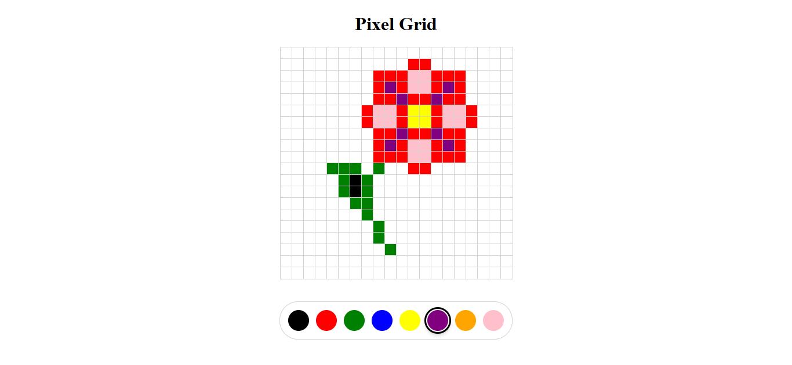

# Full-Stack Developer Mimo

<p align="center">
    <a href="https://developer.mozilla.org/pt-BR/docs/Web/JavaScript"></a>
    <a href="https://react.dev/"></a>
    <a href="https://create-react-app.dev/"></a>
    <a href="#"></a>
    <a href="LICENSE"></a>
</p>

## Sumário

- [Descrição do Projeto](#descrição-do-projeto)
- [Visualização](#visualização)
- [Arquitetura e Estrutura do Repositório](#arquitetura-e-estrutura-do-repositório)
- [Como Executar Localmente](#como-executar-localmente)
- [Uso e Exemplos](#uso-e-exemplos)
- [Troubleshooting / FAQ](#troubleshooting--faq)
- [Contribuição](#contribuição)
- [Autor](#autor)
- [Licença](#licença)

## Descrição do Projeto

Este repositório reúne projetos práticos desenvolvidos durante o curso de Full-Stack Developer da Mimo. Ele foi pensado para consolidar conceitos de desenvolvimento web moderno, especialmente em front-end com React, JavaScript, CSS e organização de componentes, além de boa estrutura de projetos e integração com APIs externas.

A proposta principal é aprender por meio de aplicações pequenas, funcionais e independentes. Cada projeto dentro de `projetos-finais/` representa um exercício ou desafio prático do curso, com foco em interatividade, usabilidade e lógica de programação aplicada à web. O repositório combina experiências de UI com alguns elementos de backend e integrações simples, oferecendo um panorama realista do desenvolvimento de soluções web.

## Visualização



## Arquitetura e Estrutura do Repositório

A organização do repositório é baseada em projetos independentes, cada um armazenado em uma pasta dentro de `projetos-finais/`.

```text
full-stack-developer-mimo/
├── LICENSE
├── README.md
├── .gitattributes
└── projetos-finais/
    ├── around-the-world/
    │   ├── public/
    │   ├── src/
    │   ├── eslint.config.js
    │   ├── index.html
    │   ├── package.json
    │   ├── vite.config.js
    │   └── README.md
    └── pixel-grid/
        ├── public/
        ├── src/
        ├── package.json
        ├── server.js
        ├── preview.png
        └── README.md
```

### Projetos incluídos

#### 1. `pixel-grid`
Aplicação interativa que simula um editor de desenho por pixels. A interface permite escolher uma cor e preencher uma grade visual, com atualização em tempo real ao clicar nos blocos.

- Tecnologias principais: React, JavaScript, HTML, CSS
- Estrutura: componentes e estados em `src/`
- Arquivos centrais: `App.js`, `PixelGrid.jsx`, `Toolbar.jsx`

#### 2. `around-the-world`
Aplicação web que exibe um mapa interativo e desafia o usuário a adivinhar a localização de um aeroporto aleatório. A distância é calculada automaticamente usando coordenadas geográficas e a API pública de aeroportos.

- Tecnologias principais: React, Vite, JavaScript, Leaflet
- Fluxo: busca de dados via API e renderização geográfica em mapa
- Arquivos centrais: `App.jsx`, `AirportMap.jsx`, `distance.js`

### Fluxo de dados

O repositório não possui um backend central ou banco de dados compartilhado. Em vez disso, cada projeto funciona de forma autônoma:

- a interface React recebe dados do usuário ou de uma API pública;
- o estado local é atualizado em componentes específicos;
- a renderização da interface muda conforme os eventos e os cálculos realizados.

Esse padrão favorece aprendizado e manutenção rápida, especialmente em projetos didáticos.

## Como Executar Localmente

### Pré-requisitos

- Git
- Node.js 18 ou superior
- npm
- Navegador moderno

### Verificação da instalação

```bash
node --version
npm --version
git --version
```

### Configuração de ambiente

Este repositório, em sua estrutura atual, não exige arquivos `.env` para execução local. As aplicações utilizam APIs públicas ou dados locais, e o ambiente é configurado basicamente por dependências e scripts do projeto.

### Instalação

#### 1. Clone o repositório

```bash
git clone https://github.com/GiovanniJorge/full-stack-developer-mimo.git
cd full-stack-developer-mimo
```

#### 2. Instale as dependências do projeto `pixel-grid`

```bash
cd projetos-finais/pixel-grid
npm install
```

#### 3. Instale as dependências do projeto `around-the-world`

```bash
cd ../around-the-world
npm install
```

### Execução

#### Pixel Grid

```bash
cd projetos-finais/pixel-grid
npm start
```

A aplicação será aberta em:

```text
http://localhost:3000
```

#### Around the World

```bash
cd projetos-finais/around-the-world
npm run dev
```

A aplicação será aberta em:

```text
http://localhost:5173
```

## Uso e Exemplos

### Pixel Grid

- Escolha uma cor na paleta disponível;
- clique na grade para desenhar;
- teste combinações rápidas e crie pequenos padrões visuais;
- use a aplicação como base para exercícios de React e gerenciamento de estado.

### Around the World

- A aplicação seleciona um aeroporto aleatório;
- o usuário clica no mapa para marcar uma localização aproximada;
- o sistema calcula a distância até o aeroporto e mostra o resultado.

## Troubleshooting / FAQ

### Problema: `npm install` falha
Solução:

- Verifique se a versão do Node.js está compatível;
- remova `node_modules` e `package-lock.json` e instale novamente.

```bash
rm -rf node_modules package-lock.json
npm install
```

### Problema: a aplicação não abre no navegador
Solução:

- confirme se o servidor está em execução;
- verifique se a porta indicada está disponível;
- tente acessar o endereço exibido no terminal.

### Problema: `npm start` ou `npm run dev` não inicia
Solução:

- confirme se você está na pasta correta do projeto;
- verifique se todas as dependências foram instaladas;
- confirme se não há conflitos de versão do ambiente local.

### Problema: API externa não responde
Solução:

- verifique sua conexão com a internet;
- teste o endpoint em um navegador;
- confirme se a API pública ainda está disponível.

## Contribuição

Contribuições são bem-vindas. Se você quiser colaborar, siga os passos abaixo:

1. Faça um fork do repositório.
2. Crie uma branch para a sua alteração:

```bash
git checkout -b feature/minha-contribuicao
```

3. Faça commits claros e objetivos.
4. Abra um Pull Request com uma descrição detalhada do que foi alterado.

## Autor

- Nome: Giovanni Jorge
- GitHub: [@GiovanniJorge](https://github.com/GiovanniJorge)

## Licença

Este projeto está sob a licença MIT.

```text
MIT License

Copyright (c) 2026 Giovanni Jorge

Permission is hereby granted, free of charge, to any person obtaining a copy
of this software and associated documentation files (the "Software"), to deal
in the Software without restriction, including without limitation the rights
to use, copy, modify, merge, publish, distribute, sublicense, and/or sell
copies of the Software, and to permit persons to whom the Software is
furnished to do so, subject to the following conditions:

The above copyright notice and this permission notice shall be included in all
copies or substantial portions of the Software.

THE SOFTWARE IS PROVIDED "AS IS", WITHOUT WARRANTY OF ANY KIND, EXPRESS OR
IMPLIED, INCLUDING BUT NOT LIMITED TO THE WARRANTIES OF MERCHANTABILITY,
FITNESS FOR A PARTICULAR PURPOSE AND NONINFRINGEMENT. IN NO EVENT SHALL THE
AUTHORS OR COPYRIGHT HOLDERS BE LIABLE FOR ANY CLAIM, DAMAGES OR OTHER
LIABILITY, WHETHER IN AN ACTION OF CONTRACT, TORT OR OTHERWISE, ARISING FROM,
OUT OF OR IN CONNECTION WITH THE SOFTWARE OR THE USE OR OTHER DEALINGS IN THE
SOFTWARE.
```
