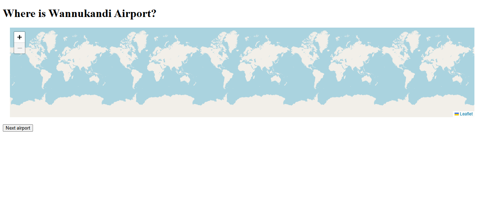

# Around the World



Descrição
--------
Around the World é uma aplicação interativa desenvolvida com React e Vite. O jogo seleciona um aeroporto aleatório e desafia o usuário a descobrir sua localização clicando em um mapa-múndi. Depois do palpite, a aplicação revela o aeroporto, mostra a distância entre os pontos e informa o resultado em quilômetros.

Funcionalidades
--------------
- Seleção de um aeroporto aleatório por meio de uma API pública.
- Mapa-múndi interativo para registrar o palpite do usuário.
- Marcadores para o aeroporto e para a localização escolhida.
- Linha visual conectando o palpite ao aeroporto correto.
- Cálculo da distância em quilômetros usando a fórmula de Haversine.
- Botão para iniciar um novo desafio.
- Interface de mapa com Leaflet e OpenStreetMap.

Como usar (Local)
--------

### Pré-requisitos
Certifique-se de ter instalado:
- **Node.js** (versão 18 ou superior)
- **npm** (gerenciador de pacotes do Node.js)

Verifique a instalação no terminal:
```bash
node --version
npm --version
```

### Instalação e Execução

1. Clone ou baixe o repositório:
```bash
git clone https://github.com/GiovanniJorge/full-stack-developer-mimo.git
cd full-stack-developer-mimo/projetos-finais/around-the-world
```

2. Instale as dependências do projeto:
```bash
npm install
```

3. Inicie o servidor de desenvolvimento:
```bash
npm run dev
```

4. Acesse no navegador o endereço exibido pelo Vite, normalmente `http://localhost:5173`.

### Parando o servidor
Para parar a aplicação, pressione `Ctrl + C` no terminal.

Como funciona
---------------------
A aplicação busca um aeroporto aleatório na API `https://airports.mimo.dev/api/random-airport` assim que é carregada. O usuário clica em qualquer ponto do mapa para registrar uma tentativa.

**Fluxo de operação:**
1. O componente `App.jsx` solicita um aeroporto aleatório e gerencia o estado do desafio.
2. O componente `AirportMap.jsx` inicializa o mapa Leaflet e captura o clique do usuário.
3. A localização clicada é comparada com as coordenadas do aeroporto selecionado.
4. A função `getDistanceInKm()` calcula a distância entre os dois pontos usando a fórmula de Haversine.
5. O mapa exibe os marcadores, a linha entre as localizações e o resultado em quilômetros.

Arquivos principais
-------------------
- `src/App.jsx` — componente principal e gerenciamento do desafio.
- `src/AirportMap.jsx` — mapa interativo, marcadores e captura dos palpites.
- `src/distance.js` — cálculo da distância entre coordenadas geográficas.
- `src/App.css` — estilos da aplicação.
- `src/index.jsx` — ponto de entrada da aplicação React.
- `index.html` — documento inicial e carregamento do Leaflet.
- `package.json` — configuração de dependências e scripts.

Tecnologias
-----------
- **React** 19.2.8 — biblioteca para construção da interface.
- **Vite** 8.2.0 — ferramenta de desenvolvimento e build.
- **JavaScript (ES6+)** — lógica da aplicação.
- **Leaflet** 1.9.4 — biblioteca para o mapa interativo.
- **OpenStreetMap** — fonte dos tiles do mapa.
- **Node.js & npm** — ambiente e gerenciamento de dependências.

Estrutura do Projeto
--------------------
```
projetos-finais/around-the-world/
│
├── src/
│   ├── assets/
│   ├── App.jsx
│   ├── AirportMap.jsx
│   ├── App.css
│   ├── distance.js
│   ├── index.css
│   ├── index.jsx
│   └── ...
│
├── public/
├── index.html
├── package.json
├── vite.config.js
├── eslint.config.js
├── preview.png
└── README.md
```

Scripts Disponíveis
-------------------

No diretório do projeto, você pode rodar:

### `npm run dev`
Inicia o servidor de desenvolvimento do Vite com atualização automática durante as alterações.

### `npm run build`
Gera a versão otimizada da aplicação para produção na pasta `dist`.

### `npm run lint`
Executa o ESLint para verificar problemas de qualidade e padrão no código.

### `npm run preview`
Inicia um servidor local para visualizar a versão compilada para produção.

Extensões Futuras
------------------
- Exibir informações adicionais sobre o aeroporto encontrado.
- Adicionar pontuação conforme a proximidade do palpite.
- Criar histórico de tentativas e resultados.
- Permitir selecionar níveis de dificuldade.
- Aperfeiçoar o tratamento de erros da API.

Acessibilidade e boas práticas
------------------------------
- Componentes separados por responsabilidade.
- Estado do desafio gerenciado com React Hooks.
- Limpeza dos elementos do mapa ao atualizar o desafio ou desmontar o componente.
- Cálculo geográfico isolado em uma função reutilizável.
- Uso de dados e mapas públicos para manter o projeto simples e didático.

Contribuição
------------
Contribuições são bem-vindas! Sugestões:
- Melhorar a experiência visual e a responsividade.
- Adicionar testes para o cálculo de distância.
- Implementar pontuação e níveis de dificuldade.
- Aperfeiçoar o tratamento de erros da API.

Para contribuir:
1. Fork este repositório.
2. Crie uma branch com sua feature: `git checkout -b minha-feature`.
3. Faça commits descritivos.
4. Abra um Pull Request descrevendo as mudanças.

Solução de Problemas
--------------------

**Problema:** A aplicação não inicia depois de `npm run dev`.
- **Solução:** Verifique se as dependências foram instaladas com `npm install` e se a porta exibida pelo Vite está disponível.

**Problema:** O mapa não aparece.
- **Solução:** Verifique a conexão com a internet, pois os estilos do Leaflet e os tiles do OpenStreetMap são carregados externamente.

**Problema:** Um novo aeroporto não é carregado.
- **Solução:** Confirme sua conexão com a internet e verifique se a API pública está respondendo.

Licença
-------
Este projeto faz parte do repositório educacional Full-Stack Developer Mimo e está sob a licença MIT do repositório principal.

Autor
-----
Giovanni Jorge — repositório principal: [GiovanniJorge/full-stack-developer-mimo](https://github.com/GiovanniJorge/full-stack-developer-mimo)

Contato
-------
Problemas, dúvidas ou sugestões podem ser abertas como issues no repositório ou enviadas pelo perfil do GitHub.
