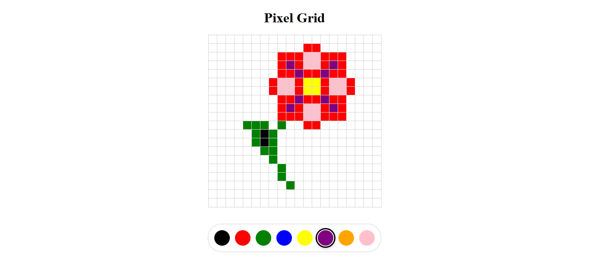

# Pixel Grid



Descrição
--------
Este é um projeto interativo de desenho em pixel grid implementado em React, HTML, CSS e JavaScript. A aplicação permite desenhar em uma grade de pixels (20x20) com cores customizáveis em tempo real. O projeto foi criado como exercício educacional e como exemplo prático de gerenciamento de estado em React, interação com componentes e manipulação dinâmica do DOM.

Funcionalidades
--------------
- Grade de pixels 20x20 para desenhar.
- Seleção de cores através de uma paleta interativa.
- Interface responsiva e intuitiva.
- Atualização em tempo real ao clicar nos pixels.
- Componentes React bem organizados e reutilizáveis.
- Suporte a backend (opcional) para persistência de dados com Express.js.

Como usar (Local)
--------

### Pré-requisitos
Certifique-se de ter instalado:
- **Node.js** (versão 14.0 ou superior)
- **npm** (gerenciador de pacotes do Node.js)

Verifique a instalação no terminal:
```bash
node --version
npm --version
```

### Instalação e Execução

1. Clone ou baixe o repositório:
```bash
git clone https://github.com/GiovanniJorge/full-stack-developer-mimo.git
cd full-stack-developer-mimo/projetos-finais/pixel-grid
```

2. Instale as dependências do projeto:
```bash
npm install
```

3. Inicie o servidor de desenvolvimento:
```bash
npm start
```

4. O navegador abrirá automaticamente em `http://localhost:3000`. Caso contrário, acesse manualmente.

### Parando o servidor
Para parar a aplicação, pressione `Ctrl + C` no terminal.

Como funciona
---------------------
A aplicação utiliza React para gerenciar uma grade dinâmica de pixels. Cada pixel é um elemento interativo que armazena suas coordenadas (x, y) e cor.

**Fluxo de operação:**
1. O componente `App.js` gerencia o estado global da grade com React Hooks (`useState`).
2. Cada pixel é um objeto com propriedades: `{ x, y, color }`.
3. Ao clicar em um pixel, a função `updateColor()` atualiza o estado com a cor selecionada.
4. O componente `PixelGrid` renderiza todos os pixels da grade.
5. O componente `Toolbar` permite selecionar a cor desejada.

**Cores iniciais:**
- Todos os pixels começam com cor branca.
- A cor padrão de desenho é preto.

Exemplos
--------
**Antes (grid inicial):**
- Grade 20x20 com todos os pixels em branco.

**Depois (após desenhar):**
- Pixels clicados mudam para a cor selecionada na toolbar.

Arquivos principais
-------------------
- `src/App.js` — componente principal com gerenciamento de estado.
- `src/App.css` — estilos do componente App.
- `src/PixelGrid.jsx` — componente responsável por renderizar a grade.
- `src/PixelGrid.css` — estilos da grade de pixels.
- `src/Toolbar.jsx` — componente da barra de ferramentas com seletor de cores.
- `src/Toolbar.css` — estilos da toolbar.
- `src/index.js` — ponto de entrada da aplicação React.
- `src/index.css` — estilos globais.
- `package.json` — configuração de dependências e scripts.
- `server.js` — arquivo para backend (opcional, ainda vazio).

Tecnologias
-----------
- **React** 19.2.5 — biblioteca para construir interfaces.
- **HTML5** — estrutura semântica.
- **CSS3** — estilização e layout responsivo.
- **JavaScript (ES6+)** — lógica da aplicação.
- **Node.js & npm** — gerenciador de dependências.
- **Express.js** 5.2.1 (opcional) — para implementação futura de backend.
- **CORS** 2.8.6 (opcional) — para requisições cross-origin.

Estrutura do Projeto
--------------------
```
projetos-finais/pixel-grid/
│
├── src/
│   ├── App.js
│   ├── App.css
│   ├── PixelGrid.jsx
│   ├── PixelGrid.css
│   ├── Toolbar.jsx
│   ├── Toolbar.css
│   ├── index.js
│   ├── index.css
│   └── ...
│
├── public/
│   └── (arquivos estáticos)
│
├── package.json
├── package-lock.json
├── server.js (backend opcional)
└── README.md
```

Scripts Disponíveis
-------------------

No diretório do projeto, você pode rodar:

### `npm start`
Executa a aplicação em modo de desenvolvimento.
Abra [http://localhost:3000](http://localhost:3000) no navegador.

A página recarrega automaticamente quando você faz alterações.
Possíveis erros de lint aparecerão no console.

### `npm test`
Inicia o test runner em modo interativo.
Veja a documentação sobre [testes](https://facebook.github.io/create-react-app/docs/running-tests) para mais informações.

### `npm run build`
Compila a aplicação para produção na pasta `build`.
Otimiza e minifica o código para melhor desempenho.

A aplicação está pronta para ser implantada!

### `npm run eject`
**Nota: esta é uma operação irreversível. Uma vez feito, você não pode voltar atrás!**

Se desejar ter controle total sobre a configuração do webpack e das ferramentas, pode usar `eject`. Isto copia todas as configurações para o seu projeto.

Extensões Futuras
------------------
- Implementar backend com Express.js para salvar desenhos no servidor.
- Adicionar recurso de undo/redo.
- Incluir mais opções de cores e paletas pré-configuradas.
- Adicionar botão de limpar/resetar a grade.
- Implementar suporte para diferentes tamanhos de grade.
- Exportar desenhos como imagem (PNG/SVG).

Acessibilidade e boas práticas
------------------------------
- Componentes bem separados e reutilizáveis.
- Estado gerenciado de forma eficiente com React Hooks.
- Código comentado para facilitar compreensão.
- Uso mínimo de dependências externas.
- Padrão de nomenclatura consistente para variáveis e funções.

Contribuição
------------
Contribuições são bem-vindas! Sugestões:
- Melhorar a performance da renderização da grade.
- Implementar sistema de camadas/histórico de edições.
- Adicionar suporte para atalhos de teclado.
- Criar temas de cores predefinidos.
- Implementar exportação de imagens.

Para contribuir:
1. Fork este repositório.
2. Crie uma branch com sua feature: `git checkout -b minha-feature`.
3. Faça commits descritivos.
4. Abra um Pull Request descrevendo as mudanças.

Solução de Problemas
--------------------

**Problema:** A aplicação não inicia depois de `npm start`.
- **Solução:** Verifique se todas as dependências foram instaladas com `npm install` e se a porta 3000 não está em uso.

**Problema:** Erros de "módulo não encontrado".
- **Solução:** Delete `node_modules` e `package-lock.json`, então rode `npm install` novamente.

**Problema:** Mudanças no código não aparecem no navegador.
- **Solução:** Verifique se o servidor está rodando e tente limpar o cache do navegador (Ctrl+Shift+Delete).

Licença
-------
Nenhuma licença específica foi adicionada a este repositório por enquanto. Se desejar, adicione um arquivo `LICENSE` (por exemplo MIT) para permitir reuso explícito.

Autor
-----
Giovanni Jorge — repositório principal: [GiovanniJorge/full-stack-developer-mimo](https://github.com/GiovanniJorge/full-stack-developer-mimo)

Contato
-------
Problemas, dúvidas ou sugestões podem ser abertas como issues no repositório ou enviadas via perfil do GitHub.
